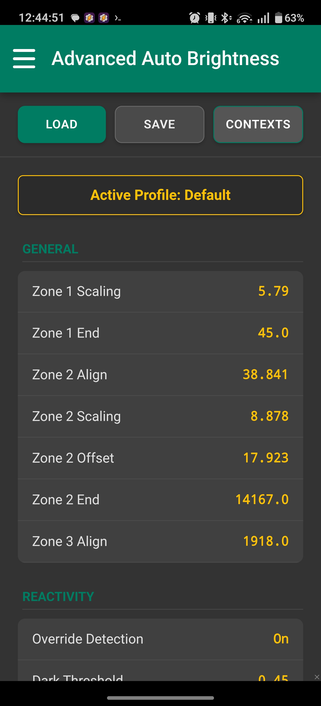

# Advanced Auto Brightness

<p align="center">
  
</p> 
<p align="center">
  <a href="https://github.com/faded-penguin021/AdvancedAutoBrightness/releases">
    
  </a> 
  <a href="https://github.com/faded-penguin021/AdvancedAutoBrightness/releases">
    
  </a> 
  <a href="https://github.com/faded-penguin021/AdvancedAutoBrightness/stargazers">
    
  </a> 
  <a href="https://github.com/faded-penguin021/AdvancedAutoBrightness/blob/main/LICENSE">
    
  </a> 
</p>

## *A glass box replacement for Android's adaptive brightness system.*

*Tired of Android auto-brightness that's too dim or too bright? Advanced Auto Brightness (AAB) is a customizable alternative to apps like Lux and Velis Auto Brightness. Create bespoke brightness curves that match your lighting conditions, eliminate PWM-induced eye strain, and let your phone automatically adapt to different contexts like watching videos, being outdoors, or reading at night.*

Stock Android adaptive auto brightness is a black box. You teach it by adjusting the slider, but you never see what it learned. Advanced Auto Brightness (AAB) rejects this approach entirely.

AAB is a full replacement built natively in Tasker with deterministic math you can see and control. Java-accelerated core logic, context-aware profile switching, and real-time visual feedback give you complete authority over your display.

---
<p align="center">
  
</p>
<i>The visual abstract above was <strong>AI generated</strong></i>.
<br><br>

Readme tl;dr? <a href="https://github.com/faded-penguin021/AdvancedAutoBrightness/blob/main/assets/pitch/AAB_SlideDeck.pdf">
  <strong>AI generated slide deck</strong>
  </a> which summarizes the project!

## Table of Contents

- [Features at a Glance](#features-at-a-glance)
- [Automatic Curve Fitting](#automatic-curve-fitting)
- [Profiles & Context Automation](#profiles--context-automation)
- [Hybrid Dimming](#hybrid-dimming)
- [Circadian Scaling](#circadian-scaling)
- [Core Architecture](#core-architecture)
- [Installation & Setup](#installation--setup)
- [Configuration Guide](#configuration-guide)
- [Troubleshooting](#troubleshooting)
- [Contributing](#contributing)
- [License](#license)

### Features at a Glance
* **Three-zone perceptual brightness model** with real-time curve visualization
* **Automatic curve fitting** from your manual adjustments using stochastic optimization
* **Profile system**: Save and switch between customizable brightness configurations (Presets are: Default, Battery Saver, Video Streaming, Outdoors, Night Reading)
* **Context automation**: Automatically load profiles based on app, time, location, battery state, or day of week
* **Hybrid Dimming**: Lock hardware brightness above PWM flicker threshold, dim using privileged APIs or software overlay
* **Circadian scaling**: Brightness curve shifts with sunrise/sunset for natural day/night adaptation
* **Reactivity controls**: Eliminate sensor jitter with configurable dead zones and dynamic smoothing
* **Live debug info**: Real-time readouts of sensor data, algorithmic decisions, and active context
* **Emergency recovery**: Flip phone upside down and shake for S.O.S. vibration and immediate brightness restore
* **Plugin-free**: Pure Tasker + Java, no external dependencies

### Automatic Curve Fitting

https://github.com/user-attachments/assets/d00b2529-91a4-4ef4-9df2-9f15d5b951ec
> **📹 Watch: AAB Curve Fitting Demo**  
> *See the automatic curve solver in action, fitting a three-zone brightness model to real usage data*

Enable Override Detection and use your phone normally. Each time brightness feels wrong, adjust the slider. AAB logs the correction when you release it. After collecting 9+ data points across different lighting conditions, the curve solver uses basin-hopping optimization to fit a three-part piecewise function to your perception.

You get explicit metrics: R² per zone, normalized RMSE, bias analysis, stability assessment. You see exactly how well the math matches your behavior.

```text
Refined Best: Z1e=94.23, Z2e=6934.6, Cost=1.5986
R² Zones: [0.91, 0.86, 0.93]
Fit Stability: Moderate (Max Impact: 48.4%)
🏆 Overall Fit: Very Good
```

### Profiles & Context Automation

<p align="center">
  
  <br/>
  <em>Save profiles and create automation rules</em>
</p>

**Profiles** let you save complete brightness configurations (curve parameters, reactivity settings, circadian scaling, super dimming) and switch between them instantly. AAB ships with five defaults, but customization options are endless:

* **Default**: Balanced baseline for general use
* **Battery Saver**: Aggressive dimming, minimal animations, high reactivity thresholds
* **Video Streaming**: Slow reactivity, super dimming enabled for dark room viewing
* **Outdoors**: Extended high-brightness range, faster transitions, no dimming
* **Night Reading**: Low brightness with Hybrid Dimming mode enabled

**Context Automation** makes profiles load automatically based on triggers:

* **Day of week**: Different brightness on weekdays vs weekends
* **App focus**: Load "Video Streaming" when YouTube opens
* **Time range**: Dim at night, brighten in morning (with midnight wraparound support)
* **Battery level**: Switch to "Battery Saver" below 20%
* **Location**: "Outdoors" profile when you leave home/work geofence

**Priority & Specificity**: When multiple contexts match, highest priority wins. Equal priority? Most specific context wins (e.g., "App + Time + Location" beats "Time only"). This prevents conflicts and gives you precise control.

The veto system ensures battery efficiency: context evaluation only runs when relevant state changes (app switch, battery delta ≥5%, location drift ≥100m, midnight rollover).

### Hybrid Dimming

<p align="center">
  
  <br/>
  <em>PWM-safe dimming configuration</em>
</p>

If you're sensitive to PWM flicker (headaches, eye strain at low brightness), AAB's hybrid dimming provides DC-like dimming:

1. Set hardware brightness floor above PWM threshold (e.g., 120/255)
2. AAB never lets hardware brightness drop below that floor
3. Further dimming uses Android's Reduce Bright Colors API (privileged mode) or software overlay (unprivileged)
4. Screen dims smoothly without entering flicker zone

https://github.com/user-attachments/assets/a9a2d577-edad-43ec-8fe6-116c1f49b583
> **📹 Watch: Hybrid Dimming Comparison**  
> *Privileged mode (Reduce Bright Colors) vs unprivileged (overlay)*

<details>
<summary>Why do the recordings look different?</summary>

Screen recorders capture differently depending on dimming method:

| **Privileged Mode** | **Unprivileged Mode** |
| :---: | :---: |
| Uses `Reduce Bright Colors` API | Uses software overlay |
| Recording looks "too bright" (dimming happens at hardware level after capture) | Recording looks very dark (captures the black pixel layer) |
| **What you see:** Perfect contrast, accurate colors | **What you see:** Reduced contrast, black crush |

Privileged mode yields superior quality. Grant elevated permissions for best results.

</details>

### Circadian Scaling

<p align="center">
  
  <br/>
  <em>Time-of-day brightness adaptation</em>
</p>

Your perception of brightness changes throughout the day. AAB shifts your entire curve based on local sunrise/sunset times. Enable circadian scaling, inspect the Circadian Graph, and watch how your curve adapts from morning through night.

_If location is unavailable, AAB falls back to IP geolocation or manual coordinates._

## Core Architecture

<details>
<summary>Click to view technical details</summary>

#### Glass Box Engineering
Every metric is accessible in real-time. Live debug scene shows sensor data, zone logic, smoothing alpha, override state, active context, and profile. Chart.js graphs visualize brightness curves, reactivity dead zones, circadian shifts, super dimming strength, and EMA alpha response.

#### Three-Zone Perceptual Model
Human brightness perception isn't linear. AAB uses C0 continuous piecewise functions:
* **Zone 1**: Square root scaling for low-light sensitivity
* **Zone 2**: Cube root(ish) scaling for mid-range balance
* **Zone 3**: Asymptotic tail for high-brightness compression

Each zone has tunable parameters. The curve solver finds optimal values automatically from your training data.

#### Java-Accelerated Core
Critical logic runs in Java Code actions: regression, signal processing, curve generation, context evaluation. Direct Thread.sleep() control eliminates Tasker Wait action overhead. Animation task calculates optimal sleep duration from actual loop timing.

#### Battery Efficiency
Event-driven architecture avoids polling. Java engine tracks hardware state—if calculated brightness matches current, AAB does nothing. Context veto system reduces evaluations by ~85%: only processes relevant state changes (app switch if app is cached, battery ≥5% delta, location ≥100m drift, midnight rollover).

</details>

## Installation & Setup

### Requirements
* Tasker (latest beta recommended) **or** standalone APK on Android 8.1+

### Basic Setup
1. Disable stock Adaptive Brightness
2. Import AAB into Tasker or install APK from [GitHub Releases](https://github.com/faded-penguin021/AdvancedAutoBrightness/releases)
3. Grant permissions when prompted
4. Open Brightness Settings via hamburger menu
5. Toggle Main Service on

### Optional: Enhanced Super Dimming
For system-level Reduce Bright Colors (more efficient than overlays):

**Tasker users:**
```bash
adb shell pm grant net.dinglisch.android.taskerm android.permission.WRITE_SECURE_SETTINGS
```

**APK users:**
```bash
adb shell pm grant com.tideo.aab android.permission.WRITE_SECURE_SETTINGS
```

### Optional: Circadian Scaling
* **Automatic**: Enable location services for GPS-based sunrise/sunset
* **Manual**: AAB falls back to IP geolocation or set `%AAB_Latitude`/`%AAB_Longitude` variables

## Configuration Guide

<details>
<summary>Click to view settings reference</summary>

#### Brightness Settings
Design your core brightness response with the three-zone model:
* **Zone 1 Scaling & End**: Low-light sensitivity (square root)
* **Zone 2 Align, Scaling & Offset**: Mid-range behavior (cube root-ish); alignment auto-calculated
* **Zone 3 Align**: High-brightness tail (asymptotic); alignment auto-calculated

Watch the Brightness Graph update in real-time as you adjust parameters.

#### Reactivity Settings
* **Dark/Dim/Bright Threshold**: Dead zones at different lux ranges
* **Curve Slope & Mid**: Dead zone shape on logarithmic scale
* **Override Detection**: Enable to log manual adjustments as training data

#### Misc Settings
* **Animation Steps**: Brightness change smoothness (more = smoother, slightly more CPU)
* **Min/Max Wait**: Millisecond animation timing bounds
* **Smoothing Δ**: EMA alpha control (lower = more smoothing, higher = faster response)

#### Circadian Settings
* **Spread**: Curve shift magnitude over 24 hours
* **Transit Factor**: Twilight transition duration
* **Steepness**: Twilight transition sharpness
* **Taper Mid & Slope**: Dynamic range compression at high brightness

#### Super Dimming Settings
* **Strength Setpoint**: Max dimming strength (capped at 65% to prevent black screens)
* **SD Exponent**: Gamma-like perceptual correction
* **SD Thresh / PWM Thresh**: Brightness level for dimming activation or hardware floor
* **Software Exp**: Gamma correction for overlay mode

#### Profile & Context Settings
* **Save Profile**: Store current configuration with custom name
* **Load Profile**: Apply saved configuration
* **Add Context**: Create automation rule with triggers (day, app, time, battery, location) and priority
* **Edit/Delete**: Modify or remove existing contexts

</details>

## Troubleshooting

<details>
<summary>Common issues and solutions</summary>

**Accidentally configured a black screen?**

Turn phone upside down (charging port up) and shake vertically. AAB acknowledges with S.O.S. vibration and forces brightness to maximum.

**Curve solver poor fit?**

* Collect more data points across broader lux range
* Spread data evenly (not clustered in one lighting condition)
* Check `%AAB_Test` for zone-specific issues
* Precision tip: Adjustment isn't logged until you release slider

**Brightness stops adapting after a while?**

Aggressive OEM battery management may kill the service. Visit [dontkillmyapp.com](https://dontkillmyapp.com/) for manufacturer-specific fixes.

**Context not triggering?**

* Open debug scene to see active context and veto logs
* Check priority conflicts (higher priority contexts override lower)
* Verify trigger cache (app must appear in installed apps, location must have valid GPS)
* Enable debug mode (`%AAB_Debug` = 8) for detailed evaluation logs

</details>

## Contributing
This project is "my child." I do not accept direct pull requests.

However:
* Discuss changes by opening an issue first
* Bug reports welcome—open an Issue for crashes, logic errors, or unexpected behavior
* See [CONTRIBUTING](CONTRIBUTING.md) for details

## License
MIT License - See [LICENSE](LICENSE) for details

Copyright (c) 2025 - 2026 /u/v_uurtjevragen
