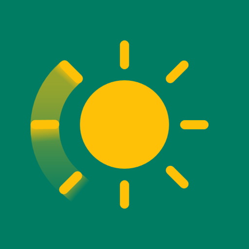
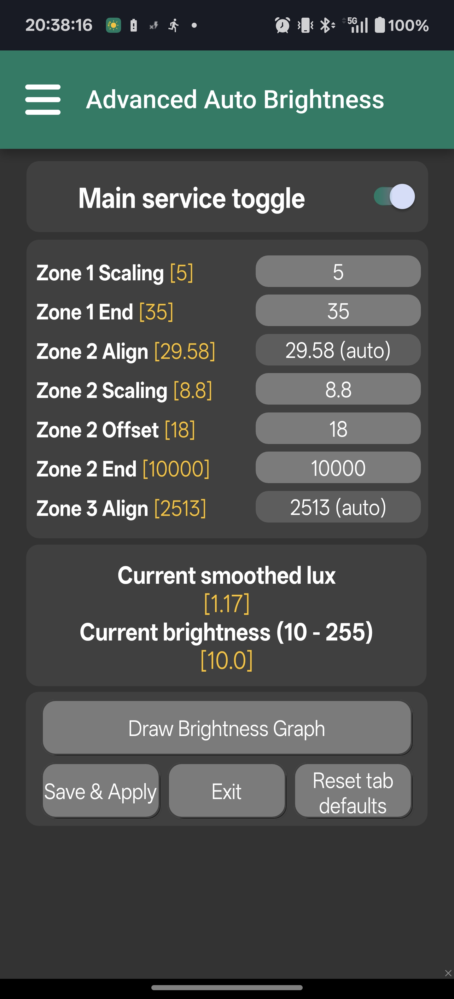
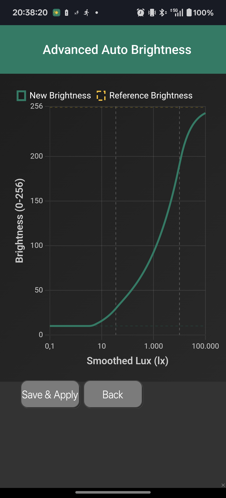
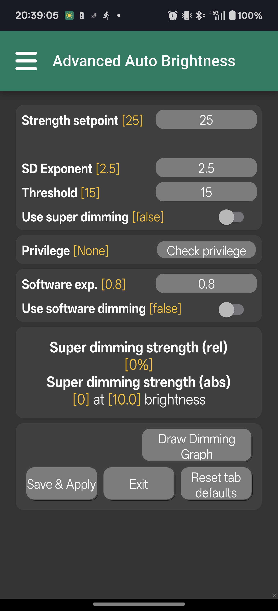

# Advanced Auto Brightness

<p align="center">
  
</p> 
<p align="center">
  
  <a href="https://github.com/faded-penguin021/AdvancedAutoBrightness/releases">
    </a> <a href="https://github.com/faded-penguin021/AdvancedAutoBrightness/blob/main/LICENSE">
    
  </a>
</p>

## *A glass box replacement for Android's adaptive brightness system.*

Stock Android adaptive auto brightness relies on opaque machine learning. You teach it by adjusting the slider, but you never see what it learned, can't inspect the curve, and have no undo beyond "reset everything." Advanced Auto Brightness (AAB) rejects this black box approach entirely.

AAB is a full replacement for native Android auto brightness with deterministic math you can see and control. A plugin free solution built natively in Tasker with Java-accelerated core logic.

<p align="center">
  
  <br/>
  <em>The main settings interface with real-time controls</em>
</p>

### Features at a Glance
* Page-based UI with hamburger menu navigation (General, Reactivity, Misc, Circadian, Super Dimming)
* Real-time visualization of every adjustment before you apply it
* Manual adjustments can become training data for the curve solver
* Basin-hopping inspired optimization with transparent quality metrics
* Reactivity settings eliminate sensor jitter with threshold-based reactivity control
* Dynamic alpha EMA responds fast to real changes, filters noise
* Brightness curve can shift with sunrise/sunset for natural day/night adaptation
* Ability to lock hardware brightness above perceptible PWM flicker threshold and use Hybrid Dimming to create DC-like dimming. 
* Go darker than Android minimum with Super Dimming using privileged methods (Reduce Bright Colors) or overlays
* Accidentally configured a black screen? Flip phone upside down and shake vertically for S.O.S. vibration and immediate brightness recovery. **Note: not all phones have axes and sensors in the right orientation. Test this first!**
* Live readouts of all internal state, sensor data, and algorithmic decisions (settings pages, graphs and debug scene)
* Quick start documentation accessible from the hamburger menu

### Live visual feedback

<p align="center">
  
  <br/>
  <em>Real-time brightness curve visualization</em>
</p>

Every settings page includes real-time graphing. Change a parameter and hit draw graph to see the effects. This enables understanding the impact of the changes **before** applying them.

Graphs include:
* *Brightness Graph*: Plots your custom parameters against a reference baseline
* *Reactivity Graph*: Visualizes sensor dead zones
* *Circadian Graph*: Shows how your brightness graph shifts throughout the day relative to sunrise/sunset
* *Super Dimming Graph*: Previews the strength of the privileged reduce bright colors method or unprivileged overlay to dim beyond minimum brightness
* *Alpha Graph*: Displays the dynamic input smoothing response for different brightness deltas

### Automatic Curve Fitting

https://github.com/user-attachments/assets/d00b2529-91a4-4ef4-9df2-9f15d5b951ec
> **📹 Watch: AAB Curve Fitting Demo**  
> *See the automatic curve solver in action, fitting a three-zone brightness model to real usage data*

In AAB, manual brightness adjustments can be used as training data **if** you enable override detection. Each manual adjustment gets logged the moment you let go of the brightness slider. When you have enough data (a minimum of 9 data points) spread across different lighting conditions, go to the Brightness Graph and hit the Suggest values button.

The curve fitting engine uses stochastic optimization inspired by basin-hopping to fit a three-part piecewise function to your actual usage patterns. It gives you explicit metrics: R² per zone, normalized RMSE, bias analysis, and stability assessment. You see exactly how well the math matches your perception. 

Snippet of the %AAB_Test variable: 
```text
Refined Best: Z1e=94.23, Z2e=6934.6, Cost=1.5986
R² Zones: [0.91, 0.86, 0.93]
Fit Stability: Moderate (Max Impact: 48.4%)
🏆 Overall Fit: Very Good
```

### Reactivity

<p align="center">
  
  <br/>
  <em>Configure sensor dead zones and reactivity behavior</em>
</p>

Ambient light sensors are noisy. Shadows from your hand, passing clouds, or screen reflections shouldn't trigger brightness changes. AAB uses multiple layers of intelligence:

AAB ignores sensor fluctuations below configurable thresholds (a sensor dead zone) for different lighting conditions. This creates a dynamic hysteresis band.

Exponential Moving Average (EMA) smoothing ensures noisy sensor readings are smoothed with an adaptive alpha that depends on the relative magnitude of light change. 

_Note: The balance between responsiveness and stability is always a trade off between jitter and responsiveness. But you are in control!_

### Hybrid Dimming
If you're sensitive to Pulse Width Modulation (PWM) flicker, e.g. you experience eye strain, headaches from rapid imperceptible screen pulsing at low brightness, AAB provides a potential solution: DC-like dimming.

The Problem: Most OLED and some LCD displays use Pulse Width Modulation to dim. Stock Android rarely lets you avoid this.

AAB's Solution: Hybrid dimming
* This allows you to set a hardware brightness floor above the level that PWM causes health issues (e.g., 120/255)
* AAB locks hardware brightness at or above that floor
* Further dimming uses Android's Reduce Bright Colors API (with elevated permissions) or a software overlay (without)
* Your screen dims smoothly without ever entering the flicker zone


https://github.com/user-attachments/assets/a9a2d577-edad-43ec-8fe6-116c1f49b583
> **📹 Watch: Hybrid Dimming Comparison - Privileged vs Unprivileged Mode**  
> *Side-by-side demonstration of system-level Reduce Bright Colors vs software overlay dimming*

#### Visualizing Hybrid Dimming: Why the videos look different

Because AAB offers two distinct Hybrid Dimming methods, screen recordings capture them very differently.

| **Privileged Mode (Root/ADB WiFi/Write Secure Settings/Shizuku)** | **Unprivileged Mode (Standard)** |
| :---: | :---: |
| *Left hand side recording* | *Right hand side recording* |
| **Technique:** `Reduce Bright Colors` API | **Technique:** Software Overlay |
| **What the recorder sees:** The recorder captures the perfect digital image **before** it is sent to the display driver. The dimming happens at the hardware level, invisible to the recorder. | **What the recorder sees:** The recorder captures the **black pixel layer** drawn over the screen. As it gets stronger, the recording goes very dark. |
| **What *you* see:** The screen gets dimmer while maintaining perfect contrast and color accuracy. | **What *you* see:** The screen gets dimmer, but contrast is reduced (i.e. black crush). |

> **The Takeaway:**
> *   **Unprivileged Mode:** The recording looks broken/black because it's literally drawing transparent black pixels on top of your screen.
> *   **Privileged Mode:** The recording looks "too bright" because the dimming is happening physically in the display controller, which yields a much higher quality result in real life. **This is why it is recommended to grant elevated permissions.**

### Circadian scaling

<p align="center">
  
  <br/>
  <em>Time-of-day brightness adaptation settings</em>
</p>

Your perception of brightness changes throughout the day. A brightness of 20% at noon feels dim, but might blind you in the middle of the night. AAB has the option to shift your entire curve based on local sunrise and sunset times and thereby respects your circadian rhythm.

Enable it, inspect the Circadian Graph, and see how your curve adapts from morning through night. 

_Note: if no location and/or date are set, AAB will try to use your current location and the current date._

### Target audience

#### Former Velis Auto Brightness users
Velis was a major inspiration to AAB. It's no longer being maintained and risks being broken by Android permission hardening. AAB is designed to provide the same philosophy of user empowerment, rebuilt for modern Android.

#### PWM Sensitive users
If low brightness gives you headaches or eye strain, you're likely reacting to PWM flicker. Most Android devices offer no escape. AAB's hybrid dimming system was built specifically to address this: lock hardware brightness high, dim via software or privileged APIs, never flicker.

#### Night Owls
Do you use your phone in dimly lit environments and do you feel your screen doesn't get dim enough? AAB's Super Dimming functionality solves exactly this issue! It enables dimming that is not dependent on your minimum backlight level, yet can further darken the screen.

### Core Architecture

#### Glass Box Engineering
Most important metrics are accessible through the UI in real-time via the Live Debug Info scene or visualized in various Chart.js graphs.

#### Three-Zone Perceptual Model
Human brightness perception isn't linear. AAB uses piecewise functions that are automatically C0 continuous:
* Zone 1: Square root scaling for low light sensitivity
* Zone 2: Cube root(ish) scaling for mid-range balance
* Zone 3: Asymptotic tail for high-brightness compression

Each zone has tunable parameters (scaling factors, exponents, offsets, alignment points). 

If you enable manual override detection the solver finds optimal values automatically. You can hand-tune if you prefer.

#### Java-Accelerated Core
V3.2 moves critical logic into Java Code actions for:
* Direct Thread.sleep() control to eliminate overhead of Tasker's Wait action 
* Regression, signal processing, and curve generation run at higher speeds
* The animation task calculates optimal sleep duration based on actual loop timing.

Note: in its current architecture the main brightness loop is **not much faster** due to inter-process context switching between native Tasker and Java.

#### Battery efficiency
The display is your phone's biggest power consumer. Depending on the configuration, AAB often reduces overall power consumption by keeping brightness lower and more appropriate than stock auto brightness. Moreover, the architecture is event-driven and avoids active polling where possible. 

The Java engine tracks hardware state. If calculated brightness matches current brightness, AAB does nothing. 

Exception: PWM safe mode with overlay dimming uses slightly more power (higher backlight + software mask). For PWM sensitive users, preventing headaches might be worth the trade-off.

### Installation & Setup

### Requirements
* Tasker (latest beta recommended until Java Code and Sunrise/Sunset actions hit stable)
* Android 8.1+ (tested primarily on Android 15)

Note: for the standalone apk file you must bypass Google Play Protect and manually navigate a complex permission setup. This is **not** normal. You should generally **never** trust an app that forces you to bypass system security warnings, targets older Android versions to evade restrictions, or requires manual "fixes" to basic permission flows as that is behavior typically found in malware.

### Download
GitHub Releases (includes source .prj.xml for verification)

### Basic Setup
* Disable stock Adaptive Brightness
* Import AAB into Tasker or install from GitHub release
* Run the Advanced Auto Brightness task from your launcher (kid app) or Tasker
* Grant permissions when prompted (AAB will guide you through this)
* Open the main Brightness Settings screen via the hamburger menu
* Flip the Main service toggle to activate

Optional: Enhanced Super Dimming

For system level Reduce Bright Colors dimming (more efficient than overlays):

For Tasker via ADB:
```bash
adb shell pm grant net.dinglisch.android.taskerm android.permission.WRITE_SECURE_SETTINGS
```
For apk file via ADB:
```bash
adb shell pm grant com.tideo.aab android.permission.WRITE_SECURE_SETTINGS
```

Optional: Circadian scaling
* Automatic: Enable location services; AAB uses GPS for sunrise/sunset calculation
* Manual: If location is disabled, AAB falls back to http://ip-api.com/json for approximate coordinates
* Alternative: Set %AAB_Latitude and %AAB_Longitude variables manually to avoid network calls entirely

### Privilege levels

AAB is designed to work fully on unrooted devices with standard Android permissions. Elevated access is optional and enhances specific features without changing core functionality.

#### Standard (no elevated permissions)
Everything works: three-zone brightness model, circadian scaling, override learning, curve fitting, smoothing, hysteresis, reactivity control, Hybrid Dimming mode via overlay, all UI scenes, live graphs, debug diagnostics.

This is the configuration designed for most users running the .apk file.

#### Elevated permissions
Unlocks system-level Reduce Bright Colors API (Android 12+) for Hybrid Dimming and Super Dimming, which is more efficient than overlays.

### Configuration Guide

#### Brightness Settings
This is where you design your core brightness response. The three-zone model gives you precise control across the full lux spectrum:
* Zone 1 Scaling & End: Controls low-light sensitivity using square root scaling
* Zone 2 Align, Scaling & Offset: Mid-range behavior with cube root(ish) scaling; alignment is auto-calculated for continuity
* Zone 3 Align: High-brightness tail with asymptotic behavior; alignment is auto-calculated

Adjust parameters, watch the Brightness Graph update in real-time, compare against the reference curve.

#### Reactivity Settings
Controls how AAB responds to sensor changes:
* Dark/Dim/Bright Threshold: Creates smart dead zones at different lux ranges to eliminate jitter
* Curve Slope & Mid: Tunes the dead zone's shape on a logarithmic scale
* Override Detection: When enabled, AAB pauses when you manually adjust brightness and logs the correction as training data.

#### Misc Settings

<p align="center">
  
  <br/>
  <em>Animation and smoothing fine-tuning</em>
</p>

Fine-tune the feel of brightness transitions:
* Animation Steps: How many discrete steps in a brightness change (more = smoother, uses slightly more CPU)
* Min/Max Wait: Millisecond bounds on animation timing
* Smoothing Δ: Controls the exponential moving average alpha: lower = more smoothing (can influence perceived responsiveness) ; higher = faster response (can influence perceived jitter)

#### Circadian Settings
Controls time-of-day brightness adaptation:
* Spread: How wide the scale shifts over the day
* Transit Factor: Controls the duration of the twilight transition times
* Steepness: Determines how sharp the twilight transition is.
* Taper Mid & Slope: Direct control over dynamic range compression at high brightness

#### Super Dimming Settings

<p align="center">
  
  <br/>
  <em>Hybrid dimming and PWM-safe configuration</em>
</p>

Configures super dimming or hybrid dimming behavior:
* Strength Setpoint: Maximum dimming strength for super dimming (capped to 65% to prevent black screens).
* SD Exponent: Gamma-like correction for perceptual dimming linearity
* SD Thresh: Brightness level at which super dimming kicks in **Or** PWM Thresh: Hardware brightness floor, AAB never goes below this
* Privilege Check: detects available elevated access (Write Secure/Root/ADB WiFi/Shizuku)
* Software Exp: Gamma correction specifically for Hybrid Dimming

### Live Debug Info
Shows real-time information:
* Current smoothed lux and raw sensor readings
* Target brightness and actual hardware brightness
* Active zone and parameters
* Current dead zone thresholds
* Smoothing alpha value
* Override detection state
* Circadian scaling factor (if enabled)
* Super dimming state (if active)

### Using the Curve Fitting Engine
The curve solver is what makes AAB adaptive without being opaque.

#### How It Works
* Enable Override Detection on the Reactivity Settings page
* Use your phone normally: when brightness feels wrong, adjust the slider
* AAB logs the correction the moment you release the slider
* Collect >8 data points spread across different lighting conditions (dim indoor, bright outdoor, everything in between), the Suggest values button won't be visible before that
* Tap Suggest values in the Brightness Graph page.
* Review the results: R² per zone, nRMSE, bias, stability analysis displayed in toast and saved to %AAB_Test
* Apply new parameters if fit quality is good, or continue collecting data if not
* Tip: you can tap a blue dot (override data point) to delete it

### Troubleshooting

*Accidentally configured a black screen?*

Turn your phone upside down (charging port facing up) and shake vertically. AAB will acknowledge with an S.O.S. vibration pattern, immediately stop all tasks, disable overlays, and force brightness to maximum.

*Curve solver poor fit?*

* Collect more data points across broader lux range
* Note: you can be very precise with the brightness slider as the adjustment isn't logged until you let go of the slider
* Ensure data points are spread evenly (not all clustered in one lighting condition)
* Check %AAB_Test output for specific zone issues and collect more data in weak zones

*Brightness suddenly stops adapting / not responsive after a while?*

Please visit [don't kill my app](https://dontkillmyapp.com/) to see how to mitigate agressive OEM battery managementn that kills the service.


### Contributing
This project is "my child." I do not accept pull requests. The main branch is reserved strictly for my own releases. Any PRs opened will be closed without review.

However:
* Forking is strongly encouraged: Under the MIT License, you're free to modify the logic, adopt the algorithms, build your own variants, and release them in your own repositories
* Bug reports welcome: Open an Issue if you find crashes, logic errors, or unexpected behavior
* Feature discussions: Use the Discussions tab for math questions, feature suggestions, or implementation ideas
* See [CONTRIBUTING](CONTRIBUTING.md) for full details.

### License
MIT License - See [LICENSE](LICENSE) for details.

Copyright (c) 2025 /u/v_uurtjevragen
